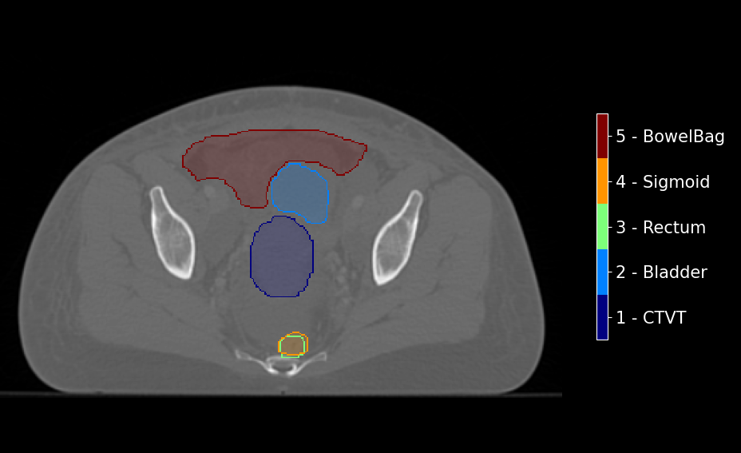

# PlotNIfTI

## Table of contents

* [General info](#general-info)
* [Example](#example)
* [Dependencies](#dependencies)

## General info

| Features                        | Status              |
|---------------------------------|---------------------|
| List of segmentations           | :white_check_mark:  |
| Align to centroid of first seg. | :white_check_mark:  |
| Show filled with transparency   | :white_check_mark:  |
| Show contour                    | :white_check_mark:  |
| Seg. list for colormap          | :white_check_mark:  |

Bastien Rigaud, PhD Laboratoire Traitement du Signal et de l'Image (LTSI), INSERM U1099 Campus de Beaulieu, Université
de Rennes 1 35042 Rennes, FRANCE bastien.rigaud@univ-rennes1.fr

## Example

<p align="center">
    
</p>

<p align="center">


</p>

```python
from PlotNIfTI import PlotNifti

def main():
    image_path = r"C:\Data\Data_test\plot_cervix_ct\image.nii.gz"
    segmentation_paths = [r"C:\Data\Data_test\plot_cervix_ct\CTVT.nii.gz",
                          r"C:\Data\Data_test\plot_cervix_ct\Bladder.nii.gz",
                          r"C:\Data\Data_test\plot_cervix_ct\Rectum.nii.gz",
                          r"C:\Data\Data_test\plot_cervix_ct\Sigmoid.nii.gz",
                          r"C:\Data\Data_test\plot_cervix_ct\BowelBag.nii.gz"]
    # segmentation_names is optional, but usefull to add a colormap
    plot_object = PlotNifti(image_path=image_path, segmentation_paths=segmentation_paths,
              show_contour=True, show_filled=True, transparency=0.20, get_at_centroid=True,
              segmentation_names=['CTVT', 'Bladder', 'Rectum', 'Sigmoid', 'BowelBag'])

    for view in ['sagittal', 'axial', 'coronal']:
        output_path = r"C:\Data\Data_test\plot_cervix_ct\screenshot_{}.png".format(view)
        plot_object.set_view(view)
        plot_object.set_output_path(output_path)
        plot_object.generate_plot()
```

## Dependencies

```
pip install -r requirements.txt
```
